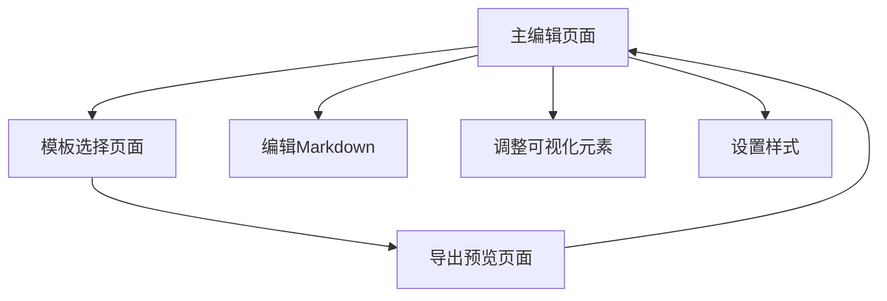

## 1. Product Overview

**md2pic** 是一个现代化的Web应用程序，专门用于将Markdown文档转换为精美的可视化图片，特别适用于社交媒体内容创作（如小红书、微博、朋友圈等）。

* 核心目标：提供所见即所得的拖拽式编辑界面，快速将文档内容转换为社交媒体友好的图片格式，支持多种主题和样式选择。

* 目标市场：内容创作者、社交媒体运营人员、个人用户，解决传统文档到图片转换的复杂性和视觉效果不佳的问题。

## 2. Core Features

### 2.1 User Roles

| Role         | Registration Method | Core Permissions   |
| ------------ | ------------------- | ------------------ |
| Default User | 直接访问，无需注册           | 可使用所有核心功能：编辑、预览、导出 |

### 2.2 Feature Module

我们的md2pic需求包含以下主要页面：

1. **主编辑页面**：Markdown编辑器、可视化画布、样式控制面板
2. **导出预览页面**：图片预览、格式选择、批量导出
3. **模板选择页面**：预设模板、画布格式选择

### 2.3 Page Details

| Page Name | Module Name | Feature description                     |
| --------- | ----------- | --------------------------------------- |
| 主编辑页面     | Markdown编辑器 | 实时编辑Markdown内容，支持语法高亮、文件导入导出、拖拽上传功能     |
| 主编辑页面     | 可视化画布       | 将Markdown解析为可视化元素，支持拖拽移动、尺寸调整、就地编辑、撤销重做 |
| 主编辑页面     | 样式控制面板      | 全局样式设置（主题色、字体大小、对齐方式）、元素级样式编辑（颜色、字体调节）  |
| 主编辑页面     | 表格处理模块      | 解析Markdown表格，智能列宽分配，支持单元格编辑和样式设置        |
| 导出预览页面    | 单页导出        | 使用html2canvas生成高清PNG图片，自动文件命名，下载状态反馈    |
| 导出预览页面    | 批量导出        | 一键导出所有页面为ZIP文件，进度提示，错误处理                |
| 模板选择页面    | 画布格式设置      | 预设社交媒体格式（小红书、微博、朋友圈等），自定义尺寸，缩放预览        |
| 模板选择页面    | 多页面分割       | 按标题自动分页，页面导航切换，分割级别选择                   |

## 3. Core Process

**主要用户操作流程：**

用户首先进入主编辑页面，在Markdown编辑器中输入或导入内容，系统实时解析并在可视化画布中显示。用户可以通过拖拽调整元素位置，使用样式控制面板修改外观。完成编辑后，用户可以选择画布格式和模板，最后通过导出功能生成图片文件。

## 4. User Interface Design

### 4.1 Design Style

* **主色调**：蓝色系 (#2563eb)，辅助色包括绿色 (#059669)、橙色 (#ea580c)、紫色 (#7c3aed)

* **按钮样式**：圆角现代风格，支持渐变效果

* **字体**：界面使用系统字体，编辑器使用等宽字体（JetBrains Mono/Consolas/Monaco）

* **布局风格**：三栏布局（编辑器、画布、控制面板），可拖拽调整，卡片式组件设计

* **图标风格**：简洁线性图标，支持emoji表情

### 4.2 Page Design Overview

| Page Name | Module Name | UI Elements                  |
| --------- | ----------- | ---------------------------- |
| 主编辑页面     | Markdown编辑器 | 深色背景编辑区域，语法高亮显示，拖拽上传区域，工具栏按钮 |
| 主编辑页面     | 可视化画布       | 白色画布背景，元素选择框，拖拽手柄，对          |

